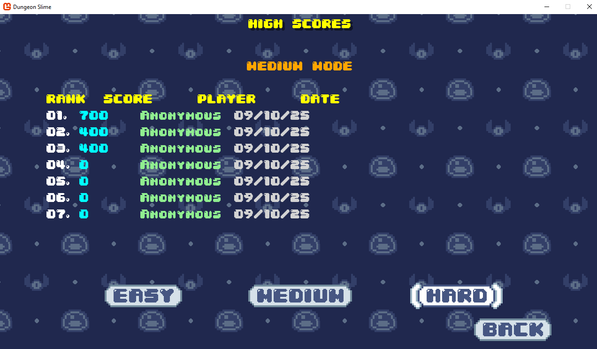

# Dungeon Slime

A classic snake-style game built with MonoGame and C#. Navigate your growing slime through dungeons, avoid obstacles, and collect items while your slime gets longer and longer!

## Download

The game is available as a standalone Windows x64 executable on Itch.io.

**[Download DungeonSlime-win-x64](https://derarbiter.itch.io/dungeon-slime?secret=8sLtkb84e3KBbsryYvQaoOr2As)**

## Screenshots

### Main Menu


### Easy Mode Gameplay


### Medium/Hard Mode Gameplay


### High Scores


## Development Requirements

To build and modify the game from source, you'll need:

### Required Software
- **.NET 8.0 SDK** or later
- **Visual Studio 2022** (recommended) or **Visual Studio Code** with C# extension
- **MonoGame 3.8** framework

### Dependencies
The game uses the following NuGet packages:
- `MonoGame.Framework.DesktopGL` (3.8.*)
- `MonoGame.Content.Builder.Task` (3.8.*)
- `Gum.MonoGame` (2025.8.3.3)
- `Microsoft.Extensions.DependencyInjection` (9.0.9)
- `Microsoft.Extensions.Hosting` (9.0.9)

### Building the Project
1. Clone or download the repository
2. Open `DungeonSlime.sln` in Visual Studio
3. Restore NuGet packages (should happen automatically)
4. Build the solution (Ctrl+Shift+B)
5. Run the project (F5)

The project targets **.NET 8.0** and uses the **DesktopGL** platform for cross-platform compatibility.

### Publishing for Distribution
To create a standalone executable for distribution:

```bash
dotnet publish -c Release -r win-x64 -p:PublishReadyToRun=false -p:TieredCompilation=false --self-contained
```

This will create a self-contained Windows x64 executable in the `bin/Release/net8.0/win-x64/publish/` directory.

## Gameplay

### Objective
Control your slime as it moves through dungeon environments. Collect items to grow longer while avoiding walls and your own body segments. Survive as long as possible to achieve a high score!

### Difficulty Modes

#### Easy Mode
- **Movement**: Smooth, continuous movement in any direction
- **Speed**: Faster movement (7.0x speed multiplier)
- **Controls**: Hold movement keys for continuous movement
- **Best for**: New players or casual gameplay

#### Medium Mode
- **Movement**: Discrete tile-based movement with larger input buffer
- **Speed**: Moderate discrete movement (200ms between moves)
- **Input Buffering**: Up to 3 directional inputs can be queued
- **Controls**: Discrete directional inputs with generous input buffering
- **Best for**: Players who want tile-based gameplay with forgiving input timing

#### Hard Mode
- **Movement**: Fast discrete tile-based movement
- **Speed**: Very fast discrete movement (100ms between moves)
- **Input Buffering**: Up to 2 directional inputs can be queued
- **Collision Prevention**: Cannot reverse directly into your own body
- **Best for**: Experienced players who want high-speed, challenging gameplay

### Controls

#### Keyboard
- **Movement**: Arrow Keys or WASD
  - ↑/W: Move Up
  - ↓/S: Move Down
  - ←/A: Move Left
  - →/D: Move Right
- **Menu**: Enter to confirm, Escape to pause/back
- **Exit**: Escape (on title screen)

#### Gamepad Support
- **Movement**: D-Pad or Left Thumbstick
- **Menu Navigation**: A button to confirm, Start button to pause
- **Full Xbox controller support**

### Game Features
- **Multiple Difficulty Modes**: Choose between Easy, Medium, and Hard difficulties
- **High Score System**: Track your best performances
- **Audio Settings**: Adjustable music and sound effect volumes
- **Retro Pixel Art Style**: Classic 8-bit inspired visuals
- **Background Music**: Atmospheric dungeon theme
- **Sound Effects**: Audio feedback for actions and interactions

## Project Structure

```
DungeonSlime/
├── DungeonSlime/          # Main game project
│   ├── GameObjects/       # Game entities (Bat, Slime, SlimeSegment)
│   ├── Scenes/           # Game scenes (Title, Game, HighScore)
│   ├── Services/         # Game services (Difficulty, HighScore)
│   ├── UI/               # User interface components
│   └── Content/          # Game assets (images, audio, fonts)
└── MonoGameLibrary/      # Shared game library
    ├── Audio/            # Audio management
    ├── Graphics/         # Sprite and animation system
    ├── Input/            # Input handling
    └── Scenes/           # Scene management
```

## Credits

This game was created following the MonoGame Tutorial series found at:
https://docs.monogame.net/articles/tutorials/index.html

